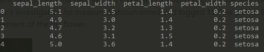

## Introduction
This following project brief is to investigate the Fishers Iris dataset using python.
This project contains research, analysis and conclusions drawn from the well-known Fisher’s iris dataset. Ronald Fisher was a British biologist and statistician who documented physical characteristics of three varieties of iris flowers – Iris setosa, Iris virginica & Iris versicolor. 
The aim of this report is to determine if the physical characteristics of the iris flower can help determine the species of the plant, from the dataset using the python programming language.

## Investigation
Using google a number of different iterations of the data set can found and the following CSV file was used in this project (INPUT CSV FILE).
As part of Fisher’s investigation he measured, documented and logged 150 Iris plants. Below is an image illustrating the sepal and petal element of the iris flower.

https://www.math.umd.edu/~petersd/666/html/iris_pca.html

The dataset consists of five number columns, four of which are dimensions (in centimetres) – Sepal Length, Sepal Width, Petal Length & Petal Width. The final column is the species of iris flower. There are 150 samples taken, 50 number for each species/class. 
## Inital data review
I order to review the data we first import it into python, we do this by applying the following code

''' 
    import pandas as pd     # We import pandas as pd to reduce the size of the code
    file = 'iris.csv'       # Declare a variable called file 
    df = pd.read_csv(file)  # We import the file and label it df
    df.head()               # This will output the top five rows of the above imported csv
'''
The above code can can provide us with a snipet of the data and provide the following output.

## How to run the code

## What the files contain

## Data Visualization

## Findings

## References
1. https://www.datacamp.com/community/tutorials/seaborn-python-tutorial
2. https://en.wikipedia.org/wiki/Iris_flower_data_set
3. https://www.math.umd.edu/~petersd/666/html/iris_pca.html
4. https://www.kaggle.com/lalitharajesh/iris-dataset-exploratory-data-analysis
5. http://archive.ics.uci.edu/ml/datasets/iris
6. https://onlinelibrary.wiley.com/doi/epdf/10.1111/j.1469-1809.1936.tb02137.x
