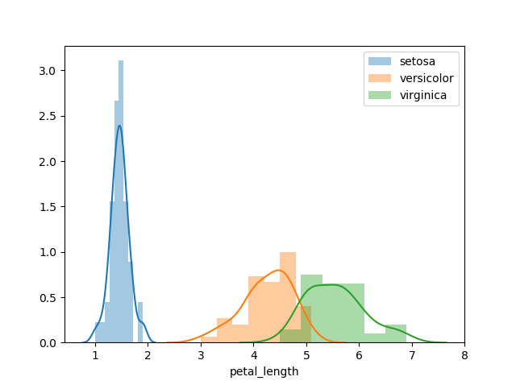
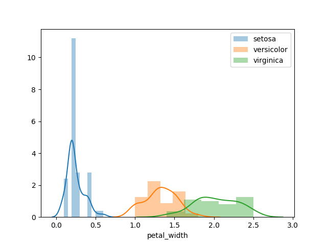
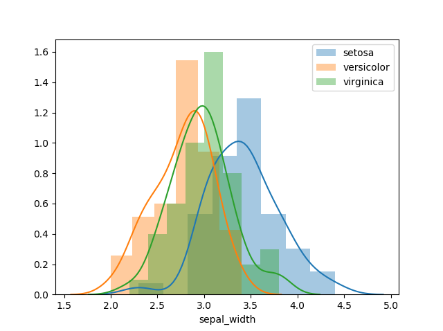
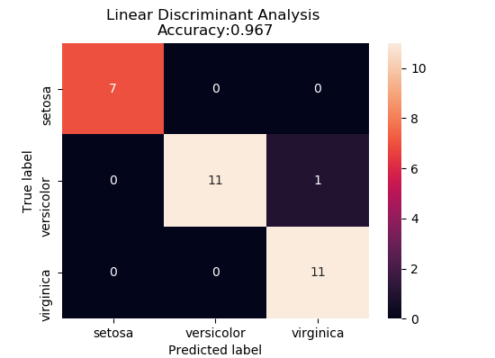

<p>
    <h1 align="center">Programming and Scripting - Pandas Project</h1>
    <p align="center"></p>
    <h3 align="center">Student: Eoghan Delaney</h3>
    <h3 align="center">Student Number: G00376462</h3>
</p>


# Introduction
The project brief was to investigate the Fishers Iris dataset using python.
This project contains research, analysis and conclusions drawn from the well-known Fisher’s iris dataset. Ronald Fisher was a British biologist and statistician who documented physical characteristics of three varieties of iris flowers – Iris Setosa, Iris Virginica & Iris Versicolor. 
The aim of this report is to determine if the physical characteristics of the iris flower can help determine the species of the plant, from the dataset using the python programming language.

# Table of Content

1. [Run Code & Modules](#1-run-code--modules)
2. [Investigation](#2-Investigation)
   
    2.1 [Initial Data Investigation](#21-inital-data-review)
    
    2.2 [Data Calculations](#22-data-caculations)
    
    2.3 [Data Visualisation](#23-data-visualization)
3. [Potential Progression/Machine Learning](#3-potential-progressionmachine-learning)
4. [Findings](#4-findings)
5. [Bibliography](#5-bibliography)

# 1. Run Code & Modules
## How to download the code?
There are two ways in which we can download the repository/project folder. The command line and a direct download from the GITHUB repository web page.

**Option number 1 – Download using the command line**
1.	Open the command line – search cmd on the task bar and press enter.
2.	You must navigate to the desired download location using cd followed by the file path.
3.	Once in the desired location, you can type the following command 
    
    $ git clone https://github.com/EoghanDelaney/pands-project
4.	Once downloaded we can move into the folder showing all the files within.


**Option number 2 – Download Zip**
1.	The second option is to navigate to the following URL on your prefered web browser. 
    
    https://github.com/EoghanDelaney/pands-project
2.	Click the green button “Clone or Download” shown on the page.
3.	Once clicked – a dropdown will appear, now click “Download as Zip”.
4.	Once the download is complete navigate to the download location you selected.
5.	Unzip the file to proceed.
6.	Once unzipped, open the folder to view the contents.


## How to run the code?
Once the download is complete we can now run the python code. In order to do this, we must have an up-to-date python 3 package installed, along with a number of essential python modules.
Navigate to the www.python.org url and download the latest version of Python 3, by following the instructions on the website. Once complete open the command line, use the pip install command for the below modules.

    • Pip install Numpy
    • Pip install Pandas
    • Pip install Seaborn
    • Pip install Skit-learn

These packages are used as part of the python script. Once complete, navigate to the location where the python script is saved. To execute the script use the below command followed by enter.
    
    Python iris_data_investigation.py 


## Python modules
___Numpy___ - 

Numpy is a python package used for fast scientific computing ***adding support for large, multi-dimensional arrays and matrices, along with a large collection of high-level mathematical functions to operate on these arrays.*** [16]

___Pandas___ - 

Pandas is an open source python library, for the preparation of data for data analysis. Pandas describes itself as a **"library providing high-performance, easy-to-use data structures and data analysis tools"** [8]. We use pandas as the data frame, a type of data structure, throughout this investigation. Pandas provides easy-to-use functions that allows for reading from csv & slicing of data, to name a few. Pandas is a must when approaching any data analytics problem in python.

___csvtomd___ - 

Csvtomd is a small light weight open source package for converting CSV files into markdown tables format.

___Mathplotlib___ - 

John Hunter was the mastermind behind the mathplotlib library. Mathplotlib is an open source python library for 2D plotting. ***“Matplotlib tries to make easy things easy and hard things possible. You can generate plots, histograms, power spectra, bar charts, errorcharts, scatterplots, etc., with just a few lines of code.”*** [17]

___Seaborn___ - 

Seaborn is a data visualisation tool for the python programming language. The package is used for data graphs, plot and charts. ***Seaborn provides a high-level interface for drawing attractive and informative statistical graphics.*** [18] Seaborn is based on the matplotlib library to generate powerful and attractive plots.


___Sklearn___ -
Sklearn


# 2. Investigation
The first step is to determine what the iris data set is. As part of Fisher’s investigation he measured, documented and logged 150 Iris plants. Below is an image, taken from Math.umd.edu illustrating the sepal and petal part of the iris flower. The petal appears to be closer to the centre of the flower. The sepal is further down the stem of the plant.
<p align="center">
    
</p>
https://www.math.umd.edu/~petersd/666/html/iris_pca.html

From searching Google, a number of different iterations of the data set can found and the following CSV file was used in this project [CSV File](http://archive.ics.uci.edu/ml/datasets/iris). The dataset consists of five number columns, four of which are dimensions (in centimeters) – Sepal Length, Sepal Width, Petal Length & Petal Width. The final column is the species of iris flower. There are 150 samples taken, 50 number for each species/class.

This assignment will attempt to use statistical models to predict the species of the relevant plant.


### Fisher's Paper
Fisher's paper **"The use of multiple measurements in taxonomic problems"** - The paper uses a statistical approach to determine the differences in the three species of Iris flower. Fisher explored *"what linear function of the four measurements will maximize the ratio of the difference between the specific means to the standard deviations within the species?"*

Fisher concluded that *"a diagnosis of these two species (virginica & versicolor) could not be based solely on these four measurements (Sepal width, sepal length, petal width and petal length) of a single flower"*.

## 2.1 Inital data review
I order to review the data we first must import it using ipython, we do this by opening up the command line and initialising ipython and applying the following code
```python
    import pandas as pd     # We import pandas as pd to reduce the size of the code
    file = 'iris.csv'       # Declare a variable called file 
    df = pd.read_csv(file)  # We import the file and label it df
    df.head()               # This will output the top five rows of the above imported csv
```
The above code can can provide us with a snippet of the data and provide the following output.

<p align="center">
    
</p>

Furthermore we can determine what type of values each column contains
```python
    # Following on from the code above
    df.dtypes
```
Getting the below output of floats and the species column is an object

<p align="center">
    
</p>

An other check we can carry out on the code is to determine if any of the samples are empty.
```python
    df.count # This line count the number of values in each of the columns
    df.isnull().values.any() # To see if any values contain nothing
```
The ouput is as follows
<p align="center">
    
    
</p>

The final check in ipython we can carry out is to determine the quantity of unique values in the 'species' column.
```python
    pd.value_counts(df['species'].values)  #This can determine the quantity of unique values of species
```
<p align="center">
    
</p>

Going forward we can now assume the dataset is complete and laid out as described in the introduction. The csv contains five number columns sepal_length, sepal_width, petal_length & petal_width witch are floats or decimal lengths in centimeters and finally a species column. The dataset as aforementioned has 50 number of each species.

## 2.2 Data caculations
At this point we can now analyse the data further. We can use the describe function to demonstrate the means, standard deviation, Max and min of each of the columns. The following section of code is performed on the entire dataset.
<p align="center">
    
</p>
This output has given a mean, standard deviation, max & min of sepal length, sepal width, petal length & petal width. A mean sepal length of 5.84cm or standard deviation of 0.433cm for the sepal width. The table also shows the max and min of petal length and width 1cm, 6.9cm, 0.1cm & 2.5cm respectively. This information is useful if we are looking at the total dataset only however we want to drill down further into the dataset to view each species individually. We can apply the describe function for each species or class. The following code can achieve this.

#### - Setosa
<p align="center">
    
</p>

#### - Versicolor
<p align="center">
    
</p>

#### - Virginica
<p align="center">
    
</p>

From the above outputs we can create the following table to illustrate the data and group the relevant outputs together.

```python
    mean = round(df.groupby('species').mean(),3)    # Group all the species an output the mean
    std = round(df.groupby('species').std(),3)      # Group all the species an output the standard deviation
    mean.to_csv('csv/species_mean.csv')             # Output the mean to a csv
    std.to_csv('csv/species_std.csv')               # Output the standard deviation to a csv
```


#### ***Table 1 - Means of all the species (cm)***
species     |  sepal_length  |  sepal_width  |  petal_length  |  petal_width
------------|---------------:|--------------:|---------------:|------------:
setosa      |  5.006         |  3.418        |  1.464         |  0.244
versicolor  |  5.936         |  2.77         |  4.26          |  1.326
virginica   |  6.588         |  2.974        |  5.552         |  2.026

#### ***Table 2 - Standard deviation of all the species (cm)***
species     |  sepal_length  |  sepal_width  |  petal_length  |  petal_width
------------|---------------:|--------------:|---------------:|------------:
setosa      |  0.352         |  0.381        |  0.174         |  0.107
versicolor  |  0.516         |  0.314        |  0.47          |  0.198
virginica   |  0.636         |  0.322        |  0.552         |  0.275

After reviewing the above table, Table 1, we can see that the mean of the petal length of the Setosa is significantly different to that of the other two species, similarly the petal width. The standard deviation (Table 2) of the Setosa’s petal length is also worth noting. This gives us an insight into the data however further investigation is required.

## 2.3 Data Visualization
A histogram can give a further insight into the data, the histogram or bar chart provides a count at each of the values for petal length & width and the same for the sepal length and width. This also give us a visual of the spread of the values.
We cab generate the histograms using the below code:
```python
    # Below is a typical example used, the variables can be interchanged for a different outcome Sepal Width, Petal Length or Petal Width
    sns.distplot(df[df.species == 'setosa']['sepal_length']) 
    # Slice the dataset extracting all the Setosa values by the sepal length

    sns.distplot(df[df.species == 'versicolor']['sepal_length']) # Same as above Versicolor

    sns.distplot(df[df.species == 'virginica']['sepal_length'])  # Same as above Viginica

    ABC = ['setosa', 'versicolor', 'virginica']     # Add a legend string for each colour

    plt.legend(ABC) # Plot the legend
    plt.show()      # Plot the graph generated above


```

<p align="center">
    
</p>
<p align="center">
    
</p>
From the above graphs we can see that the petal length and width for the setosa stands out.

In order to get a better understanding of section 2.2 we can plot the dataframe to a graph. These graphs give use a visual representation of the data and how it acts. In order to view the data we plot all species in separate on a Swarmplot from the seaborn library. A two by two graph, each one showing Petal Length, Petal Width, Sepal Length & Sepal Width.

<p align="center">
    
</p>

```python
# The above is generated by the following code
    fig, axes = plt.subplots(2, 2) # Generate four graphs 2-by-2
    axes = axes.flatten()

    # Plot all petal length in relation to species
    ax = sns.swarmplot(x="species", y="petal_length", data=df, orient='v', ax=axes[0]).set_title('Petal Length')

    # Plot all petal width in relation to species
    ax = sns.swarmplot(x="species", y="petal_width", data=df, orient='v', ax=axes[1]).set_title('Petal Width')

    # Plot all sepal length in relation to species
    ax = sns.swarmplot(x="species", y="sepal_length", data=df, orient='v', ax=axes[2]).set_title('Sepal Length')

    # Plot all sepal width in relation to species
    ax = sns.swarmplot(x="species", y="sepal_width", data=df, orient='v', ax=axes[3]).set_title('Sepal Width')
    plt.show()
```

The above graphs give us a visual depiction of what is shown in Table 1 & 2 and ***describe()*** images in section 2.2. We can focus on graph number one, Petal Length the *Setosa*, according to the describe function has a mean petal length of 1.434cm with a standard deviation of 0.174cm. The max and min are 1.9cm & 1cm respectively and this is clearly shown on the graph, as the range is between one and two. Using graph four Sepal width as the second example we can concentrate on the graph initially - looking at Versicolor in orange, we see the range between 2cm and 3.5cm however the group is weighted more towards 3cm. We can now look at Table 1 & 2, these values appear to be in line with the graph. The mean of the Versicolor is 2.77cm with a standard deviation of 0.314cm and this is in line with what we can see visually on the graph. 

We have viewed a number of examples to verify that the graph will represent what is shown in Section 2.2. This however can only illustrate a limited insights into the data. These are dimensions in isolation. The following Scatter Plots Matrix will plot all elements against one another, for example Sepal length Vs itself, Sepal length Vs Sepal Width, Sepal Length Vs Petal Width and Sepal Length Vs Petal Length. All possible combinations of plots will also be included in the matrix. However there will be a number of redundant plots - the inverses of an another. All plots will identify all species of Iris in different colours.

```python
    # Plot all of the dataframe "df" break it out per species
    sns.pairplot(df, hue='species').add_legend().fig.suptitle('Plot Matrix')
    plt.show()

```

### **Plot Matrix**

<p align="center">
    
</p>

Looking at the above Matrix there are a number of graphs that enable us to further understand the data and how it reacts. This is different to the previous plots as the ratios of data differ, previously we looked at one dimension per species and attempted to determine notable differences between species. Using the matrix we can determine if any of the ratios create enough of a difference to stand out. If we look at graph below Sepal Length Vs Sepal Width.
<p align="center">
    
</p>
The random distribution of the dataset can only give us an inconclusive result. All species of Iris flowers have sepal widths between the range of 2.5cm to 3.5cm, also all species have a sepal length of 4.5cm to circa 5.75cm. Therefore this graph is descriptive it is not gleaning any tangible insights. If we take a look at the following graph Petal Length Vs Petal Width.

<p align="center">
    
</p>

The above is a very powerful graph taken from the plot matrix. As before mentioned the ratio of petal length to petal width can give us an insight into the data. The graph clearly shows setosa flower in blue on the bottom left hand corner of the graph. Any further Setosa measurement taken would be expected in this section of the graph. The versicolor and virginica are almost split into two separate groups, however there is small overlap. It would be fair to assume any larger measurements for both Petal width and length would be Virginica however this is not proven as there is outliers in all dataset. The above can be assumed however there is no statistical significance.


#### Radviz & Andrews Curves

#### Radviz
***Each Series in the DataFrame is represented as a evenly distributed slice on a circle. Each data point is rendered in the circle according to the value on each Series. Highly correlated Series in the DataFrame are placed closer on the unit circle.*** [19]

<p align="center">
    
</p>

The radviz plot shows multi-dimensional plot of all three species of Iris flower with all dimensions sepal width, length, petal width & length laid out in a circle. The setosa is shown in a cluster off centre while the versicolor and virginica are non-distinguishable, only for the colour difference. The plot demonstrates that the versioloar and virginca are highly correlated as they are heavily plotted in the one region and the setosa is clearly identified as weighted more towards the sepal width.  
According to scikit-yb scientists use these plots to determine if there is separability between classes (Petal width, petal length, sepal width & sepal length) and this plots give a an opportunity to review the data in a different outlook.


##### Andrews Curves
*"Andrews curves are a method for visualizing multidimensional data by mapping each observation onto a function."* (https://dzone.com/articles/andrews-curves)
This functions allows the dataset to be plotted along side one another below is an example of the plot output with time t on the horizontal axis and x(t) on the vertical. 
<p align="center">
    
</p>
The function is shown below:
<p align="center">
    
</p>
where X1, X2, X3 and X4 represent the components of each of the samples taken, the sepal width, sepal length, petal length & petal width as laid out in the CSV file. t is taken as plus and minus Pi, therefor all samples are calculated from -3.14 to +3.14. The graph illustrates all 150 samples and demonstrates the pattern that it follows.

# 3. Potential Progression/Machine Learning
In this section we will briefly look at how to predict the species of flower from patterns and trends in existing data. There are a number of machine learning algorithms which can achieve this, these algorithms are based on mathematical statistical models. Although these models are beyond the scope of this assignment, we will still review the outcome based on the assumption of them being correct.
<p align="center" >
    
</p>
https://data-flair.training/blogs/machine-learning-algorithms-in-python/

The above diagram gives a list of a number of python machine learning algorithms, some algorithms are more suited to different types of datasets. In this part of the assignment we will lok at the four different algorithms and how they predict the species of plant. 

The first step when approaching a machine learning problem, we must have a learning dataset and a test dataset. This will allow the algorithm to scan through all the  data, viewing links/patterns that may not be visible to the user. The algorithm uses statistical models to approach this. Once the learning phase is complete the algorithm must then test the hypothesis it has created using a test/validation set. This set will have a predetermined known outcome. The algorithm can then predict the outcome and test if it is correct. The below code will show how to split out the data, 80% (120 of the 150 samples) Test & 20% (30 of the 150 samples) Validation, into two groups test & validation:
```python
    # At this point we split out the data - Train and Test data.
    X = df.values[:,0:4]    # X being the measurements we know
    Y = df.values[:,4]      # Y being the species/target

    # X_train - Measurements to train the algorithm
    # Y_train - Target/Species, the desired outcome
    # X_validation - To test the measurements
    # Y_validation - To test the target 
    # Important to note test_size =0.2 
    X_train, X_validation, Y_train, Y_validation = model_selection.train_test_split(X, Y, test_size=0.20, random_state=7)
```
Using the above, we can now use Sklearn to predict the 20% Validation using the below sample code. For this sample we used the K-nerist neigbour 
```python
    # The below is the training phase
    knc = KNeighborsClassifier(n_neighbors=3).fit(X_train, Y_train)
    # Below uses the trained data to predict the Validation data
    pred = knc.predict(X_validation)

```
Using the above code, graph tool and the command line we were able to output the following insights from the data. We have a graph for each of the statistical algorithms showing the confusion matrix, this matrix shows the predicted label on the horizontal axis and the true value on the vertical. The confusion matrix is also shown on the command line on the screen shot to the right. 
#### K-Nearest Neighbors
<p align="center">
    
</p>

#### Linear Discriminant Analysis
<p align="center">
    
</p>

#### Logisitic Regression
<p align="center">
    
</p>

#### Gaussian
<p align="center">
    
</p>

After reviewing all four samples it is clear that all tests were able to differentiate the setosa from the other two species. The level of accuracy therefore comes down to the differences between the Virginica and the Versicolor. Both the logistic regression and the gaussian were more inaccurate when trying to determine the species with a 80% and 83.3% score, respectively. The linear discriminant analysis was significantly more powerful when trying to validate the data with an accuracy of 96.7%, only one incorrect "guess" or prediction.

Some areas that may require further investigation may be the sample size, altering this may yield different results. In addition to this using other statistical analysis may provide more accurate or relevant conclusions.

# 4. Findings

#### Dataset
The aim of this investigation was to gain an insight into the structure and content of the Fisher Iris Flower Dataset, using python. Python can be used to determine many statistical factors

#### Insight into the Iris dataset

#### Programming

#### Key learnings
 - __Ipython__ - 
I used ipython as a key learning tool. Ipthyon enabled data manipulation at an instant level. I found type function **type()** powerful. Whenever I encountered any issue/error I i applied the type function and then inturn googles the outcome I was looking for. 

 - __GitHub__ - Github and Markdown language was a key part of this project and this has given me a much stronger insight into how both work. I encountered a number of errors and was able to solve them. After completing this project I fell allot more comfortable using put Github and Markdown language.

 - __Pandas__ - Pandas is vital when exploring a new dataset. Pandas enables speedy analysis the dataset.
 
 - __Seaborn__ - Seaborn is an incredibly powerful data visualization tool. Seaborn provides all shapes and types of graphs can be generated using this library, over the scope of this project seaborn was invaluable for plotting all the data. Going forward seaborn is a must when analyzing data and trying to visualize and depict what it represents. 
 
 - __Ski-learn__ -

It is clear that with one google search a wealth of knowledge relating to the Fishers Iris dataset can be found. The key acumen from this assignment is how to approach a dataset without any prior knowledge of it. Firstly you must understand what and how the dataset is made up. This in turn can help you extract what you want from it. Python can provide additional insights that an off the shelf spreadsheet software can not, at a much faster pace.


# 5. Bibliography
1. https://www.datacamp.com/community/tutorials/seaborn-python-tutorial
2. https://en.wikipedia.org/wiki/Iris_flower_data_set
3. https://www.math.umd.edu/~petersd/666/html/iris_pca.html
4. https://www.kaggle.com/lalitharajesh/iris-dataset-exploratory-data-analysis
5. http://archive.ics.uci.edu/ml/datasets/iris
6. https://onlinelibrary.wiley.com/doi/epdf/10.1111/j.1469-1809.1936.tb02137.x
7. https://github.com/mplewis/csvtomd
8. https://pandas.pydata.org/
9. https://pandas.pydata.org/pandas-docs/stable/user_guide/visualization.html
10. https://pandas.pydata.org/pandas-docs/stable/reference/api/pandas.plotting.radviz.html
11. https://github.com/pandas-dev/pandas/blob/v0.24.2/pandas/plotting/_misc.py#L146-L269
12. https://pandas.pydata.org/pandas-docs/stable/reference/api/pandas.plotting.andrews_curves.html#pandas.plotting.andrews_curves
13. https://en.wikipedia.org/wiki/Andrews_plot
14. https://www.kaggle.com/mjbahmani/20-ml-algorithms-15-plot-for-beginners
15. https://github.com/joeyajames/Python/blob/master/Pandas/pandas_weather.py
16. https://en.wikipedia.org/wiki/NumPy
17. https://matplotlib.org/
18. https://seaborn.pydata.org/ 
19. https://pandas.pydata.org/pandas-docs/stable/reference/api/pandas.plotting.radviz.html
20. https://glowingpython.blogspot.com/2014/10/andrews-curves.html
21. https://en.wikipedia.org/wiki/Andrews_plot
22. THE USE OF MULTIPLE MEASUREMENTS IN TAXONOMIC PROBLEMS R. A. FISHER Sc.D., F.R.S.
23. http://citeseerx.ist.psu.edu/viewdoc/download?doi=10.1.1.608.6250&rep=rep1&type=pdf

# Notes

After completing this project I believe I have a much better understanding of to code along with the principles of programming. I had not prior knowledge of programming and found the module very informative. The assignment gave a good insight into how to investigate a dataset without any prior knowledge, what approach to take when analyzing,