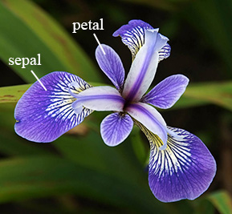

# Introduction
This following project brief is to investigate the Fishers Iris dataset using python.
This project contains research, analysis and conclusions drawn from the well-known Fisher’s iris dataset. Ronald Fisher was a British biologist and statistician who documented physical characteristics of three varieties of iris flowers – Iris Setosa, Iris Virginica & Iris Versicolor. 
The aim of this report is to determine if the physical characteristics of the iris flower can help determine the species of the plant, from the dataset using the python programming language.

### Fisher's Paper


# Table of Content

1. [Run Code & Modules](#1-Run-Code-&-Modules)
2. [Investigation](#2-Investigation)
   
    2.1 [Initial Data Investigation](#21-inital-data-review)
    
    2.2 [Data Calculations](#22-data-caculations)
    
    2.3 [Data Visualisation](#23-data-visualization)
3. [Findings](#3-findings)
4. [Potential Progression](#4-potential-progression)
5. [Bibliography](#5-bibliography)

# 1. Run Code & Modules
## How to download the code?


## How to run the code?


## Python modules
#### Numpy
Numpy is a python package used for fast scientific computing.

#### Pandas
Pandas is a open source python library, for the preperation of data for data analysis. pandas describes itself as a **"library providing high-performance, easy-to-use data structures and data analysis tools"** [8]. We use pandas as the data frame throwout this investigation. Pandas sits atop **numpy** as a module and inherits some of its functions.  

#### Seaborn

#### Mathplotlib

#### csvtomd

# 2. Investigation
Using Google a number of different iterations of the data set can found and the following CSV file was used in this project [CSV File](http://archive.ics.uci.edu/ml/datasets/iris). As part of Fisher’s investigation he measured, documented and logged 150 Iris plants. Below is an image illustrating the sepal and petal element of the iris flower.
<p align="center">
    
</p>
https://www.math.umd.edu/~petersd/666/html/iris_pca.html

The dataset consists of five number columns, four of which are dimensions (in centimetres) – Sepal Length, Sepal Width, Petal Length & Petal Width. The final column is the species of iris flower. There are 150 samples taken, 50 number for each species/class.

## 2.1 Inital data review
I order to review the data we first must import it using ipython, we do this by opening up the command line and initialising ipython and applying the following code
```python
    import pandas as pd     # We import pandas as pd to reduce the size of the code
    file = 'iris.csv'       # Declare a variable called file 
    df = pd.read_csv(file)  # We import the file and label it df
    df.head()               # This will output the top five rows of the above imported csv
```
The above code can can provide us with a snipet of the data and provide the following output.

<p align="center">
    
</p>

Furthermore we can determine what type of values each column contains
```python
    # Following on from the code above
    df.dtypes
```
Getting the below output of floats and the species column is an object

<p align="center">
    
</p>

An other check we can carry out on the code is to determine if any of the samples are empty.
```python
    df.count # This line count the number of values in each of the columns
    df.isnull().values.any() # To see if any values contain nothing
```
The ouput is as follows
<p align="center">
    
    
</p>

The final check in ipython we can carry out is to determine the quantity of unique values in the 'species' column.
```python
    pd.value_counts(df['species'].values)  #This can determine the quantity of unique values of species
```
<p align="center">
    
</p>

Going foward we can now assume the dataset is complete and laid out as described in the introduction. The csv contains five number columns sepal_length, sepal_width, petal_length & petal_width wich are floats or decimal lengths in centimeters and finaly a species column. The dataset as beforementioned has 50 number of each species.

## 2.2 Data caculations
At this point we can now analyse the data further. We can use the describe function to demonstrate the means, standard deviation, Max and min of each of the columns. The following section of code is performed on the entire dataset.
<p align="center">
    
</p>
This output has given a mean, standard deviation, max & min of sepal length, sepal width, petal length & petal width. A mean sepal length of 5.84cm or standard deviation of 0.433cm for the sepal width. The table also shows the max and min of petal length and width 1cm, 6.9cm, 0.1cm & 2.5cm respectively. This information is useful if we are looking at the total dataset only however we want to drill down further into the dataset to view each species individually. We can apply the describe function for each species or class. The following code can achieve this.

#### Setosa
<p align="center">
    
</p>

#### Versicolor
<p align="center">
    
</p>

#### Virginica
<p align="center">
    
</p>

From the above outputs we can create the following table to illustrate the data and group the relevant outputs together.

```python
    mean = round(df.groupby('species').mean(),3)    #Group all the species an output the mean
    std = round(df.groupby('species').std(),3)      #Group all the species an output the standard deviation
    mean.to_csv('csv/species_mean.csv')             #Output the mean to a csv
    std.to_csv('csv/species_std.csv')               #Output the standard deviation to a csv
```


#### ***Table 1 - Means of all the species***
species     |  sepal_length  |  sepal_width  |  petal_length  |  petal_width
------------|---------------:|--------------:|---------------:|------------:
setosa      |  5.006         |  3.418        |  1.464         |  0.244
versicolor  |  5.936         |  2.77         |  4.26          |  1.326
virginica   |  6.588         |  2.974        |  5.552         |  2.026

#### ***Table 2 - Standard deviation of all the species***
species     |  sepal_length  |  sepal_width  |  petal_length  |  petal_width
------------|---------------:|--------------:|---------------:|------------:
setosa      |  0.352         |  0.381        |  0.174         |  0.107
versicolor  |  0.516         |  0.314        |  0.47          |  0.198
virginica   |  0.636         |  0.322        |  0.552         |  0.275

After reviewing the above table, Table 1, we can see that the mean of the petal length of the Setosa is significantly different to that of the other two species, similarly the petal width. The standard deviation (Table 2) of the Setosa’s petal length is also worth noting. This gives us an insight into the data however further investigation is required.

## 2.3 Data Visualization
In order to get a better understanding of the above we can plot the dataframe to a graph. These graphs give use a visual representation of the data and how it acts. In order to view the data we plot all species in seprate on a Swarmplot from the seaborn library. A two by two graph each one showing Petal Length, Petal Width, Sepal Length & Sepal Width.

<p align="center">
    
</p>

The above graphs give us a visual depiction of what is shown in the tables and describe images in section 2.2. We can focus on graph number one Petal Length the setosa, according to the describe function has a mean petal length of 1.434cm with a standard deviation of 0.174. The max and min are 1.9cm & 1cm respectively and this is clearly shown on the graph.
# 3. Findings


# 4. Potential Progression


# 5. Bibliography
1. https://www.datacamp.com/community/tutorials/seaborn-python-tutorial
2. https://en.wikipedia.org/wiki/Iris_flower_data_set
3. https://www.math.umd.edu/~petersd/666/html/iris_pca.html
4. https://www.kaggle.com/lalitharajesh/iris-dataset-exploratory-data-analysis
5. http://archive.ics.uci.edu/ml/datasets/iris
6. https://onlinelibrary.wiley.com/doi/epdf/10.1111/j.1469-1809.1936.tb02137.x
7. https://github.com/mplewis/csvtomd
8. https://pandas.pydata.org/